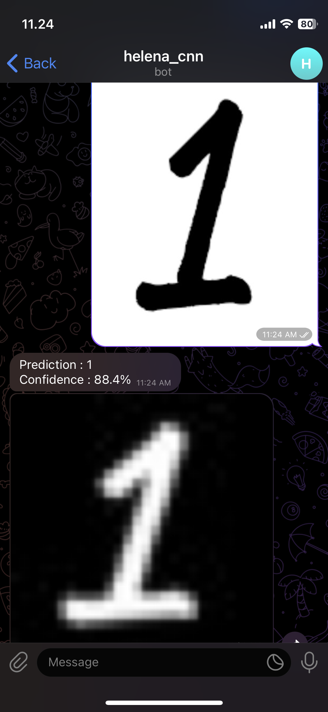

# Telegram Bot using [Convolutional Neural Network](https://github.com/helenaferdy/machine-learning-convolutional-neural-network) to make a guess based on given image of number
## Try it here [Helena CNN Bot](t.me/helena_cnn_bot)

## Demo
## image of 1
> 

## image  of 3
> 

## image of 5
> 
